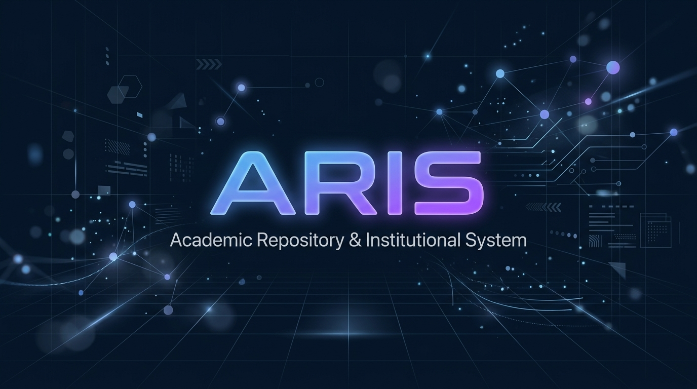
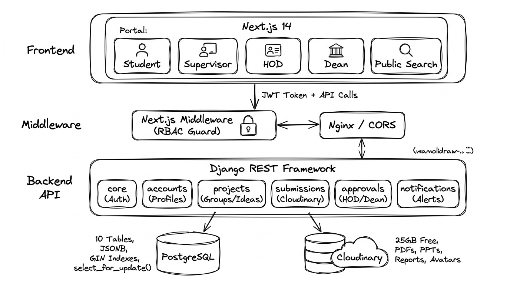

<div align="center">
  

  <br />

  # ARIS — Academic Repository & Institutional System

  **A modern, full-stack academic project management platform built for [Dev Bhoomi Uttarakhand University (DBUU)](https://www.dbuu.ac.in/)**

  [](https://www.djangoproject.com/)
  [](https://nextjs.org/)
  [](https://www.postgresql.org/)
  [](https://www.typescriptlang.org/)
  [](https://tailwindcss.com/)
  [](https://cloudinary.com/)
  [](https://jwt.io/)
  [](https://python.org/)

  <br />

  <p>
    <a href="#-problem-statement">Problem</a> •
    <a href="#-solution">Solution</a> •
    <a href="#%EF%B8%8F-system-architecture">Architecture</a> •
    <a href="#-tech-stack">Tech Stack</a> •
    <a href="#-features">Features</a> •
    <a href="#-project-structure">Structure</a> •
    <a href="#-getting-started">Setup</a>
  </p>
</div>

---

## 📋 Problem Statement

At **Dev Bhoomi Uttarakhand University (DBUU)**, the academic project lifecycle — from supervisor selection to final Dean approval — is managed through **scattered WhatsApp groups, paper forms, and manual Excel tracking**. This leads to:

- ❌ **No centralized platform** for students to discover supervisors, browse available project ideas, or form groups.
- ❌ **Race conditions** where multiple student groups unknowingly pick the same supervisor-posted project idea.
- ❌ **Zero audit trail** — HODs and Deans review projects through informal email chains with no version history or rejection feedback.
- ❌ **Missed deadlines** because submission cutoffs are communicated verbally and never enforced by any system.
- ❌ **No searchable archive** — past approved projects are lost in department folders, making it impossible for future batches to reference prior work.

---

## 💡 Solution

**ARIS** digitizes the entire academic project workflow into a **role-based, multi-tier approval platform** with 4 distinct portals:

| Role | Portal | Key Capabilities |
|---|---|---|
| 🎓 **Student** | Student Dashboard | Form groups (max 3), browse supervisor marketplace, select/propose project ideas, upload deliverables (Synopsis, PPT, Report) |
| 👨‍🏫 **Supervisor** | Supervisor Marketplace | Post up to 10 project ideas with atomic thread-locking, set intake capacity, approve/reject proposals with mandatory feedback |
| 🏛️ **HOD** | Department Review | 1-by-1 dossier review of submitted projects, enforce/extend milestone deadlines, departmental approval |
| 📜 **Dean** | School Overview | Consolidated view of all HOD-approved projects across departments, final university sign-off |

Once a project receives **Dean approval**, it enters the **public searchable archive** — indexed by academic year, domain, tech stack, supervisor, and keywords.

---

## 🏗️ System Architecture

<div align="center">
  
</div>

<br />

### Architecture Highlights

```
┌─────────────────────────────────────────────────────────────────────┐
│                     CLIENT LAYER (Next.js 14)                       │
│  App Router • TypeScript • Tailwind CSS • shadcn/ui • React Query   │
├─────────────────────────────────────────────────────────────────────┤
│                  EDGE & SECURITY LAYER                              │
│  Next.js Middleware (JWT RBAC) • Nginx Reverse Proxy • CORS         │
├─────────────────────────────────────────────────────────────────────┤
│               BACKEND API LAYER (Django + DRF)                      │
│  6 Modular Apps • JWT Auth • Role Permissions • Django Signals      │
├────────────────────────────┬────────────────────────────────────────┤
│   PostgreSQL 17            │   Cloudinary (25 GB Free)              │
│   • 10 Core Tables         │   • Synopsis PDFs                      │
│   • JSONB + GIN Indexes    │   • PPT Presentations                  │
│   • select_for_update()    │   • Final Reports                      │
│   • Append-only Audit Logs │   • Profile Avatars                    │
└────────────────────────────┴────────────────────────────────────────┘
```

---

## 🛠 Tech Stack

### Frontend
| Technology | Purpose |
|---|---|
|  | React framework with App Router, Server Components, and Edge Middleware |
|  | Type-safe development across all components |
|  | Utility-first CSS with DBUU brand color system |
|  | Accessible, customizable UI component library |

### Backend
| Technology | Purpose |
|---|---|
|  | Python web framework with ORM, Admin panel, and Signals |
|  | RESTful API endpoints, serializers, and permissions |
|  | Stateless authentication with role-based token payloads |
|  | Relational database with JSONB fields and GIN indexes |
|  | Cloud object storage for PDFs, PPTs, reports, and avatars (25 GB free) |

---

## ✨ Features

### 🔐 Authentication & Authorization
- **University ID Login** — Students log in with Roll No (e.g., `24BCA0027`), Faculty with Employee ID
- **Default Password** — Date of Birth (with mandatory change on first login)
- **JWT Token Security** — 60-minute access tokens with 7-day refresh token rotation
- **Role-Based Access Control** — Next.js Middleware guards frontend routes; DRF permissions guard API endpoints

### 👥 Group & Supervisor Management
- **Semester-Scoped Groups** — Max 3 students per group, scoped to Minor I / Minor II / Major
- **Supervisor Marketplace** — Browse faculty by expertise domain, technology stack, and available capacity
- **Intake Capacity Limits** — Supervisors set max group quotas (default: 10), enforced at API level

### 💡 Project Idea Marketplace
- **Supervisor-Posted Ideas** — Faculty post up to 10 project ideas with problem statements and tech stacks
- **Atomic Thread-Locking** — `select_for_update()` prevents race conditions when groups select ideas simultaneously
- **Proposal Versioning** — Rejected proposals create new version records with mandatory supervisor feedback

### 📄 Submission & Deliverables
- **Cloudinary Integration** — Synopsis PDFs, PPT presentations, and final reports uploaded to cloud storage
- **Milestone Tracking** — Individual timestamps for each deliverable (synopsis, PPT, report, GitHub repo)
- **Deadline Enforcement** — System rejects late uploads; only HOD/Dean can grant extensions

### ✅ Multi-Tier Approval Workflow
```
FORMED → SUPERVISOR_SELECTED → PROPOSAL_SUBMITTED → ACTIVE → SUBMITTED → HOD_APPROVED → DEAN_APPROVED → PUBLIC_ARCHIVE
```
- **HOD Review** — 1-by-1 project dossier examination with approve/reject and comments
- **Dean Review** — Consolidated school-wide view for final university sign-off
- **Immutable Audit Trail** — Every approval/rejection is append-only with mandatory reviewer comments

### 🔍 Public Project Search & Archive
- **Full-Text Search** — PostgreSQL powered search across titles, domains, and tech stacks
- **GIN Indexed Filters** — Sub-millisecond filtering by academic year, project type, supervisor, domain, or technology
- **Institutional Knowledge Base** — Dean-approved projects become a permanent, searchable archive for future batches

---

## 📁 Project Structure

```
Aris/
├── client/                          # Next.js 14 Frontend (Coming Soon)
│   ├── src/
│   │   ├── app/                     # App Router (folder-based routing)
│   │   │   ├── (auth)/login/        # University ID login page
│   │   │   ├── (dashboard)/
│   │   │   │   ├── student/         # Student portal
│   │   │   │   ├── supervisor/      # Supervisor marketplace
│   │   │   │   ├── hod/             # HOD review portal
│   │   │   │   └── dean/            # Dean overview portal
│   │   │   └── search/              # Public project archive
│   │   ├── components/              # Reusable UI components
│   │   └── middleware.ts            # JWT RBAC route guard
│   └── tailwind.config.ts           # DBUU brand color system
│
├── server/                          # Django Backend
│   ├── config/                      # Project configuration
│   │   ├── settings.py              # PostgreSQL, JWT, CORS, Cloudinary
│   │   └── urls.py                  # Root URL router
│   ├── core/                        # CustomUser, UUID base model
│   ├── accounts/                    # SupervisorProfile, StudentProfile
│   ├── projects/                    # Groups, Ideas (atomic lock), Proposals
│   ├── submissions/                 # Deliverables & Cloudinary uploads
│   ├── approvals/                   # HOD/Dean workflow & deadlines
│   ├── notifications/               # In-app alerts & signals
│   ├── requirements.txt             # Python dependencies
│   └── manage.py                    # Django CLI
│
├── assets/                          # Static assets (banner, etc.)
├── .gitignore                       # Git ignore rules
└── README.md                        # You are here
```

---

## 🚀 Getting Started

### Prerequisites

- **Python** 3.12+ → [Download](https://www.python.org/downloads/)
- **Node.js** 20+ → [Download](https://nodejs.org/)
- **PostgreSQL** 16+ → [Download](https://www.postgresql.org/download/)
- **Git** → [Download](https://git-scm.com/)

### 1. Clone the Repository

```bash
git clone https://github.com/devOakki/aris.git
cd aris
```

### 2. Backend Setup

```bash
cd server

# Create and activate virtual environment
python -m venv venv
.\venv\Scripts\activate        # Windows
# source venv/bin/activate     # macOS/Linux

# Install dependencies
pip install -r requirements.txt

# Create PostgreSQL database
# Open psql and run: CREATE DATABASE aris_db;

# Configure environment variables
# Copy .env.example to .env and update credentials

# Run migrations
python manage.py makemigrations
python manage.py migrate

# Create superadmin
python manage.py createsuperuser

# Start development server
python manage.py runserver
```

### 3. Frontend Setup (Coming Soon)

```bash
cd client
npm install
npm run dev
```

---

## 📊 Database Schema (10 Core Entities)

| # | Entity | Description |
|---|---|---|
| 1 | `CustomUser` | Base auth model with 4 roles (Student, Supervisor, HOD, Dean) and University ID login |
| 2 | `SupervisorProfile` | Faculty expertise domains/technologies, intake capacity, acceptance toggle |
| 3 | `StudentProfile` | ERP Roll Number, program (BCA/MCA/B.Tech), semester, department |
| 4 | `StudentGroup` | Semester-scoped team (max 3), supervisor assignment, lifecycle status |
| 5 | `GroupMember` | Bridge table linking students to groups with leader/member roles |
| 6 | `ProjectIdea` | Supervisor-posted ideas with atomic lock (`is_taken` + `select_for_update`) |
| 7 | `ProjectProposal` | Student proposals (from list or original), versioned with supervisor feedback |
| 8 | `ProjectSubmission` | Deliverable metadata (GitHub URL, Cloudinary PDF/PPT/Report URLs) |
| 9 | `ProjectDeadline` | Milestone cutoffs per academic year & project type (HOD/Dean extendable) |
| 10 | `ApprovalRecord` | Append-only audit trail for HOD and Dean review actions |

---

## 🎨 Design System

ARIS uses a custom color palette extracted from the official **DBUU institutional branding**:

| Token | Hex | Usage |
|---|---|---|
| 🟡 DBUU Gold | `#F5A623` | Highlights, badges, rank accents |
| 🔵 DBUU Navy | `#0F2137` | Primary navigation, dark surfaces |
| 🔴 DBUU Red | `#B81D24` | Rejections, critical alerts |
| 🟠 DBUU Orange | `#F36E21` | HOD portal accent, pending states |
| 🔷 DBUU Royal | `#1A4DBE` | Student portal accent, active links |
| 🟣 DBUU Plum | `#4A154B` | Dean portal accent, executive gradients |

**Typography:** Plus Jakarta Sans (UI) + JetBrains Mono (Code/IDs)

---

## 📄 License

This project is developed as a **BCA 5th Semester Minor Project** at Dev Bhoomi Uttarakhand University.

---

<div align="center">

  **Built with ❤️ for DBUU by [Akhil](https://github.com/devOakki)**

  ⭐ Star this repo if you find it useful!

</div>
