# ARIS — Entity Relationship Diagram (ERD) & Schema Specification

## 1. Visual Entity Relationship Diagram (Mermaid)

```mermaid
erDiagram
    CUSTOM_USER ||--o| SUPERVISOR_PROFILE : "has profile (if SUPERVISOR)"
    CUSTOM_USER ||--o| STUDENT_PROFILE : "has profile (if STUDENT)"
    CUSTOM_USER ||--o{ ACADEMIC_SESSION : "configures (Admin)"
    CUSTOM_USER ||--o{ PROJECT_TRACK : "creates (HOD)"
    CUSTOM_USER ||--o{ STUDENT_GROUP : "creates (Student Leader)"
    CUSTOM_USER ||--o{ PROJECT_DEADLINE : "sets (HOD)"
    CUSTOM_USER ||--o{ APPROVAL_RECORD : "actions review (HOD/Dean)"
    CUSTOM_USER ||--o{ NOTIFICATION : "receives"

    ACADEMIC_SESSION ||--o{ PROJECT_TRACK : "contains"

    SUPERVISOR_PROFILE ||--o{ PROJECT_IDEA : "posts ideas"
    SUPERVISOR_PROFILE ||--o{ STUDENT_GROUP : "guides / supervises"

    STUDENT_PROFILE }o--o{ STUDENT_GROUP : "belongs to (via GROUP_MEMBER)"

    PROJECT_TRACK ||--o{ STUDENT_GROUP : "regulates"
    PROJECT_TRACK ||--o{ PROJECT_DEADLINE : "enforces"

    STUDENT_GROUP ||--o{ GROUP_MEMBER : "has members (max N)"
    STUDENT_GROUP ||--o{ PROJECT_PROPOSAL : "submits"
    STUDENT_GROUP ||--o| PROJECT_SUBMISSION : "uploads deliverables"
    STUDENT_GROUP ||--o{ APPROVAL_RECORD : "reviewed via"
    STUDENT_GROUP ||--o| PROJECT_IDEA : "locks / takes (if FROM_LIST)"

    PROJECT_PROPOSAL }o--o| PROJECT_IDEA : "references (nullable)"

    CUSTOM_USER {
        uuid id PK
        string university_id UK "ERP ID / Employee ID (Login Username)"
        string email UK
        string first_name
        string last_name
        string phone
        string role "STUDENT | SUPERVISOR | HOD | DEAN"
        string department "Department name (e.g. Computer Applications)"
        string avatar_url "Cloudinary image URL"
        boolean is_active "default true"
        boolean is_staff "default false"
        datetime created_at
        datetime updated_at
    }

    ACADEMIC_SESSION {
        uuid id PK
        string year "e.g. 2026-27"
        string term "ODD (Aug-Dec) | EVEN (Jan-May)"
        boolean is_active "Single active session flag"
        uuid set_by_id FK "Admin User ID"
        datetime created_at
        datetime updated_at
    }

    STUDENT_PROFILE {
        uuid id PK
        uuid user_id FK, UK "1:1 with CustomUser"
        string program "e.g. BCA, MCA, B.Tech CSE"
        string department "e.g. Computer Applications"
        int semester "e.g. 5"
        datetime created_at
        datetime updated_at
    }

    SUPERVISOR_PROFILE {
        uuid id PK
        uuid user_id FK, UK "1:1 with CustomUser"
        string designation "e.g. Assistant Professor"
        string department "e.g. Computer Applications"
        jsonb expertise_domains "GIN indexed (e.g. ['AI/ML', 'Web Dev'])"
        jsonb expertise_tech "GIN indexed (e.g. ['Python', 'Next.js'])"
        int max_groups "default 10, supervisor capacity"
        boolean is_accepting "default true, intake toggle"
        text bio "optional"
        datetime created_at
        datetime updated_at
    }

    PROJECT_TRACK {
        uuid id PK
        string title "e.g. BCA Sem-5 Minor Project I"
        string category "MINOR_1 | MINOR_2 | MAJOR | RESEARCH | HARDWARE | INNOVATION"
        uuid session_id FK "AcademicSession"
        string department "e.g. Computer Applications"
        string target_program "e.g. BCA"
        int target_semester "e.g. 5"
        boolean is_mandatory "Curriculum vs Innovation track"
        int max_group_size "default 3"
        jsonb required_deliverables "['SYNOPSIS', 'PPT', 'REPORT', 'GITHUB']"
        int min_media_files "default 5 screenshots/photos"
        int max_media_files "default 10 screenshots/photos"
        uuid created_by_id FK "HOD User ID"
        boolean is_active "Registration status"
        datetime created_at
        datetime updated_at
    }

    STUDENT_GROUP {
        uuid id PK
        string name "e.g. Team Binary"
        uuid track_id FK "ProjectTrack"
        uuid supervisor_id FK "nullable until selected"
        uuid created_by_id FK "Leader CustomUser"
        string status "FORMED | SUPERVISOR_PENDING | PROPOSAL_PENDING | PROPOSAL_REJECTED | ACTIVE | SUBMITTED | HOD_APPROVED | DEAN_APPROVED"
        datetime created_at
        datetime updated_at
    }

    GROUP_MEMBER {
        uuid id PK
        uuid group_id FK
        uuid student_id FK
        string member_role "LEADER | MEMBER"
        datetime joined_at
    }

    PROJECT_IDEA {
        uuid id PK
        uuid supervisor_id FK "Author"
        string title
        text problem_statement
        text novelty
        string domain "e.g. AI / ML"
        jsonb technologies "e.g. ['PyTorch', 'Next.js']"
        boolean is_taken "default false (Atomic Thread-Lock)"
        uuid taken_by_id FK, UK "nullable, 1:1 when locked"
        datetime created_at
        datetime updated_at
    }

    PROJECT_PROPOSAL {
        uuid id PK
        uuid group_id FK
        string proposal_type "FROM_LIST | OWN_IDEA"
        uuid project_idea_id FK "nullable (if FROM_LIST)"
        string title "custom or inherited from idea"
        text problem_statement
        text novelty
        string domain
        jsonb technologies
        string status "PENDING | APPROVED | REJECTED"
        int version "default 1 (increments on re-submission)"
        text supervisor_feedback "mandatory if REJECTED"
        datetime decided_at "nullable"
        datetime created_at
        datetime updated_at
    }

    PROJECT_DEADLINE {
        uuid id PK
        uuid track_id FK "ProjectTrack"
        string deadline_type "SYNOPSIS | PPT | REPORT | GITHUB | CUSTOM"
        string title "optional custom milestone"
        datetime due_date "hard cutoff enforced by system"
        uuid set_by_id FK "HOD User ID"
        datetime created_at
        datetime updated_at
    }

    PROJECT_SUBMISSION {
        uuid id PK
        uuid group_id FK, UK "1:1 per Group"
        string github_repo_url "Repository link"
        string live_demo_url "Vercel / Render deployment link"
        string synopsis_url "Cloudinary PDF URL"
        string ppt_url "Cloudinary PPTX/PDF URL"
        string report_url "Cloudinary PDF URL"
        string research_paper_url "Cloudinary PDF URL (optional)"
        jsonb media_urls "Cloudinary screenshots/photos [min 5, max 10]"
        jsonb custom_deliverables "Flexible extra files"
        datetime github_submitted_at
        datetime synopsis_submitted_at
        datetime ppt_submitted_at
        datetime report_submitted_at
        datetime media_submitted_at
        datetime all_completed_at
        datetime created_at
        datetime updated_at
    }

    APPROVAL_RECORD {
        uuid id PK
        uuid group_id FK
        string stage "HOD | DEAN"
        string action "APPROVED | REJECTED"
        text comment "feedback / review remarks"
        uuid actioned_by_id FK "CustomUser (HOD / Dean)"
        datetime actioned_at
    }

    NOTIFICATION {
        uuid id PK
        uuid recipient_id FK "CustomUser"
        uuid triggered_by_id FK "nullable (CustomUser or System)"
        string event_type "PROPOSAL_SUBMITTED | PROPOSAL_APPROVED | PROPOSAL_REJECTED | SUBMISSION_DUE | SUBMISSION_DONE | HOD_APPROVED | HOD_REJECTED | DEAN_APPROVED"
        string title
        text message
        string target_url "frontend navigation route"
        boolean is_read "default false"
        datetime created_at
    }
```



---

## 2. DBML (Database Markup Language) Script
> Paste into **[dbdiagram.io](https://dbdiagram.io)** for visual interactive editing.

```dbml
// ==========================================
// ARIS Database Schema (DBML v2)
// Dev Bhoomi Uttarakhand University (DBUU)
// ==========================================

Table users {
  id uuid [pk, default: `gen_random_uuid()`]
  university_id varchar(50) [unique, not null, note: "ERP ID / Employee ID"]
  email varchar(255) [unique, not null]
  password varchar(255) [not null]
  first_name varchar(100) [not null]
  last_name varchar(100) [not null]
  phone varchar(15)
  role varchar(20) [not null, note: "STUDENT, SUPERVISOR, HOD, DEAN"]
  department varchar(100)
  avatar_url text
  is_active boolean [default: true]
  is_staff boolean [default: false]
  created_at timestamp [default: `now()`]
  updated_at timestamp [default: `now()`]
}

Table academic_sessions {
  id uuid [pk, default: `gen_random_uuid()`]
  year varchar(10) [not null, note: "e.g. 2026-27"]
  term varchar(10) [not null, note: "ODD, EVEN"]
  is_active boolean [default: true]
  set_by_id uuid [ref: > users.id]
  created_at timestamp [default: `now()`]
  updated_at timestamp [default: `now()`]
}

Table student_profiles {
  id uuid [pk, default: `gen_random_uuid()`]
  user_id uuid [unique, not null, ref: - users.id]
  program varchar(50) [not null, note: "BCA, MCA, B.Tech CSE"]
  department varchar(100) [not null]
  semester smallint [not null]
  created_at timestamp [default: `now()`]
  updated_at timestamp [default: `now()`]
}

Table supervisor_profiles {
  id uuid [pk, default: `gen_random_uuid()`]
  user_id uuid [unique, not null, ref: - users.id]
  designation varchar(100) [not null]
  department varchar(100) [not null]
  expertise_domains jsonb [default: '[]']
  expertise_tech jsonb [default: '[]']
  max_groups smallint [default: 10]
  is_accepting boolean [default: true]
  bio text
  created_at timestamp [default: `now()`]
  updated_at timestamp [default: `now()`]
}

Table project_tracks {
  id uuid [pk, default: `gen_random_uuid()`]
  title varchar(150) [not null]
  category varchar(20) [not null, note: "MINOR_1, MINOR_2, MAJOR, RESEARCH, HARDWARE, INNOVATION"]
  session_id uuid [not null, ref: > academic_sessions.id]
  department varchar(100) [not null]
  target_program varchar(50) [not null]
  target_semester smallint [not null]
  is_mandatory boolean [default: true]
  max_group_size smallint [default: 3]
  required_deliverables jsonb [default: '[]']
  min_media_files smallint [default: 5]
  max_media_files smallint [default: 10]
  created_by_id uuid [ref: > users.id]
  is_active boolean [default: true]
  created_at timestamp [default: `now()`]
  updated_at timestamp [default: `now()`]
}

Table student_groups {
  id uuid [pk, default: `gen_random_uuid()`]
  name varchar(100) [not null]
  track_id uuid [not null, ref: > project_tracks.id]
  supervisor_id uuid [ref: > supervisor_profiles.id]
  created_by_id uuid [not null, ref: > users.id]
  status varchar(25) [not null, default: 'FORMED']
  created_at timestamp [default: `now()`]
  updated_at timestamp [default: `now()`]
}

Table group_members {
  id uuid [pk, default: `gen_random_uuid()`]
  group_id uuid [not null, ref: > student_groups.id]
  student_id uuid [not null, ref: > student_profiles.id]
  member_role varchar(10) [not null, default: 'MEMBER']
  joined_at timestamp [default: `now()`]

  indexes {
    (group_id, student_id) [unique]
  }
}

Table project_ideas {
  id uuid [pk, default: `gen_random_uuid()`]
  supervisor_id uuid [not null, ref: > supervisor_profiles.id]
  title varchar(200) [not null]
  problem_statement text [not null]
  novelty text [not null]
  domain varchar(100) [not null]
  technologies jsonb [default: '[]']
  is_taken boolean [default: false]
  taken_by_id uuid [unique, ref: - student_groups.id]
  created_at timestamp [default: `now()`]
  updated_at timestamp [default: `now()`]
}

Table project_proposals {
  id uuid [pk, default: `gen_random_uuid()`]
  group_id uuid [not null, ref: > student_groups.id]
  proposal_type varchar(10) [not null, note: "FROM_LIST, OWN_IDEA"]
  project_idea_id uuid [ref: > project_ideas.id]
  title varchar(200) [not null]
  problem_statement text [not null]
  novelty text [not null]
  domain varchar(100) [not null]
  technologies jsonb [default: '[]']
  status varchar(10) [not null, default: 'PENDING']
  version smallint [default: 1]
  supervisor_feedback text
  decided_at timestamp
  created_at timestamp [default: `now()`]
  updated_at timestamp [default: `now()`]
}

Table project_deadlines {
  id uuid [pk, default: `gen_random_uuid()`]
  track_id uuid [not null, ref: > project_tracks.id]
  deadline_type varchar(15) [not null]
  title varchar(100)
  due_date timestamp [not null]
  set_by_id uuid [ref: > users.id]
  created_at timestamp [default: `now()`]
  updated_at timestamp [default: `now()`]

  indexes {
    (track_id, deadline_type) [unique]
  }
}

Table project_submissions {
  id uuid [pk, default: `gen_random_uuid()`]
  group_id uuid [unique, not null, ref: - student_groups.id]
  github_repo_url text
  live_demo_url text
  synopsis_url text
  ppt_url text
  report_url text
  research_paper_url text
  media_urls jsonb [default: '[]']
  custom_deliverables jsonb [default: '{}']
  github_submitted_at timestamp
  synopsis_submitted_at timestamp
  ppt_submitted_at timestamp
  report_submitted_at timestamp
  media_submitted_at timestamp
  all_completed_at timestamp
  created_at timestamp [default: `now()`]
  updated_at timestamp [default: `now()`]
}

Table approval_records {
  id uuid [pk, default: `gen_random_uuid()`]
  group_id uuid [not null, ref: > student_groups.id]
  stage varchar(10) [not null, note: "HOD, DEAN"]
  action varchar(10) [not null, note: "APPROVED, REJECTED"]
  comment text [not null]
  actioned_by_id uuid [ref: > users.id]
  actioned_at timestamp [default: `now()`]
}

Table notifications {
  id uuid [pk, default: `gen_random_uuid()`]
  recipient_id uuid [not null, ref: > users.id]
  triggered_by_id uuid [ref: > users.id]
  event_type varchar(25) [not null]
  title varchar(200) [not null]
  message text [not null]
  target_url varchar(300)
  is_read boolean [default: false]
  created_at timestamp [default: `now()`]
}
```
