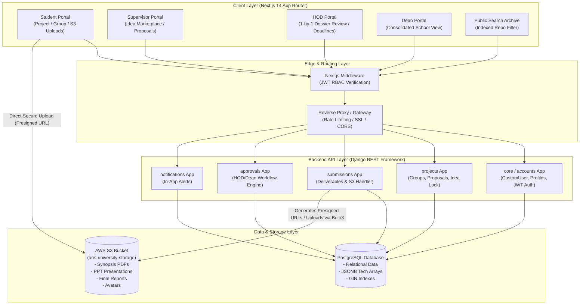
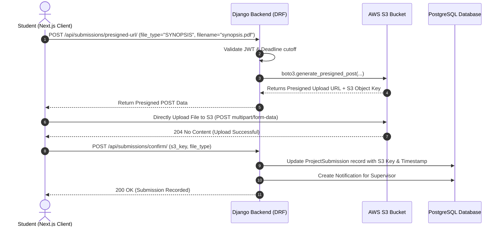
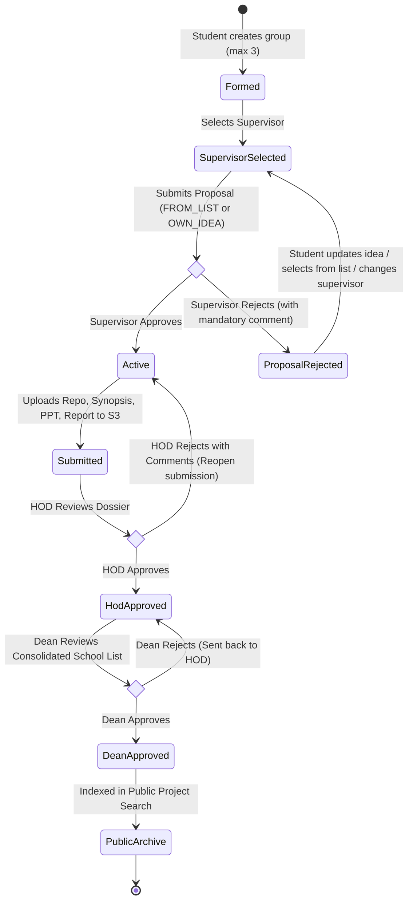

# ARIS — System Architecture & Cloud Infrastructure Design

# 1. High-Level System Architecture Diagram



---

## 2. AWS S3 Integration Architecture

### Why AWS S3 & Free Tier Utilization

- **AWS Free Tier:** AWS provides **5 GB of Standard Object Storage**, **20,000 GET Requests**, and **2,000 PUT Requests** per month free for 12 months.
- **Why It's Ideal for ARIS:**
  1. Prevents database bloat (PostgreSQL only stores clean S3 keys/URLs).
  2. Native support for secure, time-limited **Presigned URLs** so student project files (synopsis, report PDFs) are protected from unauthorized public downloads.
  3. Industry-standard skill: Direct hands-on experience configuring IAM, S3 Buckets, Boto3, and CORS.

---

### S3 Bucket Layout & Key Structure

```
s3://aris-university-storage/
├── avatars/
│   └── {user_uuid}.jpg
├── submissions/
│   └── {academic_year}/                     # e.g., 2024-25/
│       └── {project_type}/                  # e.g., MINOR_1/
│           └── group_{group_uuid}/
│               ├── synopsis_v{version}.pdf
│               ├── presentation.pptx
│               └── final_report.pdf
└── exports/
    └── {academic_year}/consolidated_records.pdf
```

---

### S3 Access Patterns & Upload Workflow

We implement **Presigned S3 URLs** for large project PDFs/PPTs. This avoids piping large files through the Django server, reducing memory usage and latency.



---

### AWS Configuration Details

#### 1. S3 Bucket CORS Configuration

Required so Next.js (running on localhost or Vercel) can upload files directly to S3:

```json
[
  {
    "AllowedHeaders": ["*"],
    "AllowedMethods": ["GET", "PUT", "POST", "HEAD"],
    "AllowedOrigins": [
      "http://localhost:3000",
      "https://aris.vercel.app"
    ],
    "ExposeHeaders": ["ETag"],
    "MaxAgeSeconds": 3000
  }
]
```

#### 2. IAM Policy for Django Application (`django-boto3-user`)

Least-privilege policy for backend S3 access:

```json
{
  "Version": "2012-10-17",
  "Statement": [
    {
      "Effect": "Allow",
      "Action": [
        "s3:PutObject",
        "s3:GetObject",
        "s3:DeleteObject",
        "s3:ListBucket"
      ],
      "Resource": [
        "arn:aws:s3:::aris-university-storage",
        "arn:aws:s3:::aris-university-storage/*"
      ]
    }
  ]
}
```

---

## 3. Core Technical Components

### A. Frontend: Next.js 14 App Router

- **Role-Based App Directory Structure:**
  ```
  client/src/app/
  ├── layout.tsx                     # Root providers (TanStack Query, Auth Context)
  ├── (auth)/
  │   └── login/page.tsx             # Universal login
  ├── (dashboard)/
  │   ├── student/                   # Group formation, Supervisor selection, S3 uploads
  │   ├── supervisor/                # Idea manager (up to 10 ideas), Proposal approvals
  │   ├── hod/                       # Department project queue, 1-by-1 dossier review
  │   └── dean/                      # Consolidated university school view
  ├── search/page.tsx                # Public project search & filtering
  └── middleware.ts                  # Server-side JWT decoding & RBAC route guard
  ```
- **UI & State:** Tailwind CSS + shadcn/ui components, React Hook Form with Zod schemas, TanStack Query for server state caching.

---

### B. Backend: Django + Django REST Framework

- **Modular App Architecture:**
  - `core`: CustomUser model, Base timestamp models, JWT Auth endpoints (`/api/auth/token/`).
  - `accounts`: SupervisorProfile, StudentProfile, Profile photo S3 uploads.
  - `projects`: StudentGroup, GroupMember, ProjectIdea (with `select_for_update` atomic lock), ProjectProposal.
  - `submissions`: ProjectSubmission, Presigned S3 URL generator, Boto3 S3 client.
  - `approvals`: ApprovalRecord, ProjectDeadline, Multi-tier review engine.
  - `notifications`: Notification model and real-time alert polling/endpoints.

---

### C. Database Layer: PostgreSQL

- Primary relational storage for all 10 entities.
- Transactional locks (`select_for_update`) to prevent race conditions during Idea selection.
- GIN Indexing on `jsonb` fields (`expertise_domains`, `technologies`) for sub-millisecond search across university projects.

---

## 4. Multi-Tier Approval Workflow Engine



---

## 5. Security & Invariant Safeguards

1. **RBAC Token Security:** JWT token includes `user_id` and `role`. Next.js middleware guards frontend routes, while DRF custom permission classes (`IsStudent`, `IsSupervisor`, `IsHOD`, `IsDean`) validate every API endpoint.
2. **Confidential Document Protection:** Student project PDF submissions on AWS S3 are set to `private` ACL. When a supervisor, HOD, or Dean views a report, Django generates a temporary signed URL valid for 15 minutes.
3. **Audit Log Immutability:** `approval_records` are append-only. Once an approval or rejection is submitted by an HOD or Dean, it can never be deleted or updated in place.
4. **Deadline Hard Enforcement:** Backend API rejects upload presigned URL requests if `now() > due_date`, unless an extension is granted in `project_deadlines` by HOD or Dean.
